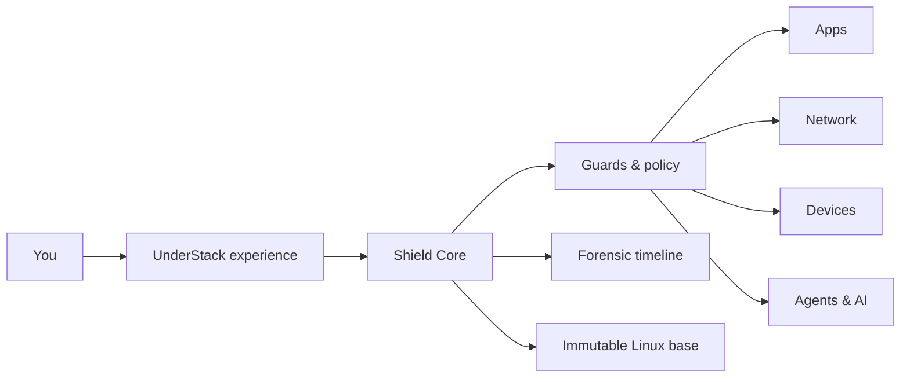
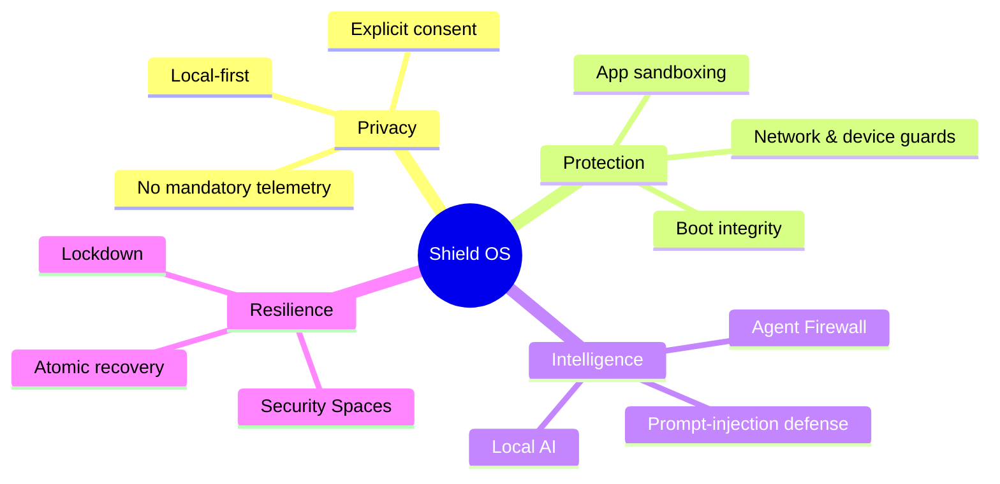
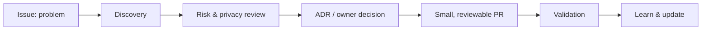

# UnderStack Shield OS

> **The private-by-default desktop.** A Linux-based security operating-system concept where protection is designed into the platform—not bolted on afterwards.

**UnderStack Shield OS** is a future desktop operating-system initiative for people who expect local control, visible trust boundaries, and security that can explain itself. This is a documentation-first repository: it contains the product foundation, not a runnable system or product code.

## The operating idea

### What it is designed to stand for

| Private by default | Secure by design | Clear to the person using it |
| --- | --- | --- |
| Local-first processing and no mandatory telemetry. | Atomic base, encryption, boot integrity, isolation and least privilege. | Explainable decisions, Security Spaces, Lockdown and an evidence-oriented timeline. |

## Project compass

## Explore the project

| Start here | Go deeper |
| --- | --- |
| [Vision and scope](docs/vision.md) | [Architecture overview](docs/architecture/overview.md) |
| [Threat model](docs/security/threat-model.md) | [Privacy model](docs/privacy/privacy-model.md) |
| [Security principles](docs/security/principles.md) | [Roadmap](docs/roadmap/roadmap.md) |
| [How we work](docs/workflows/operating-model.md) | [Decision records](docs/architecture/adr/README.md) |

## How we build trust before we build software

Every meaningful proposal follows a lightweight, evidence-led path:

Read the [operating model](docs/workflows/operating-model.md), [quality gates](docs/workflows/quality-gates.md), and [contribution guide](CONTRIBUTING.md) before proposing a change.

## Current boundary

This repository intentionally contains no application, kernel, installer, agent, telemetry, deployment, or build code. Those decisions belong to a later, reviewed discovery phase. The owner retains final control of `main`.

## Security reporting

Potential vulnerabilities must stay out of public issues. Follow [SECURITY.md](SECURITY.md).

## License

No license has been selected yet. Until one is explicitly added, all rights are reserved.
