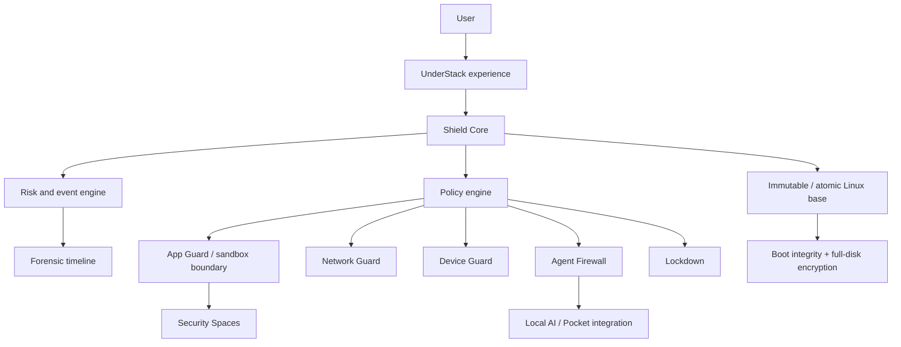

# Architecture overview

This is a conceptual model, not an implementation specification. Technology choices remain subject to ADRs and threat-model review.

## Design layers

| Layer | Intended responsibility |
| --- | --- |
| Immutable base | Minimize drift, support atomic update and recovery concepts. |
| Shield Core | Coordinate events, policy, risk signals and explanations. |
| Guards | Mediate app, network, device and agent trust-boundary crossings. |
| Security Spaces | Separate sensitive contexts and reduce blast radius. |
| User experience | Present choices, consent, containment and forensic information clearly. |

## Linux security direction

The project will evaluate eBPF for observability, LSM/SELinux for mandatory access control, and sandboxing mechanisms for workload isolation. These are candidate mechanisms, not present commitments to a particular implementation.
