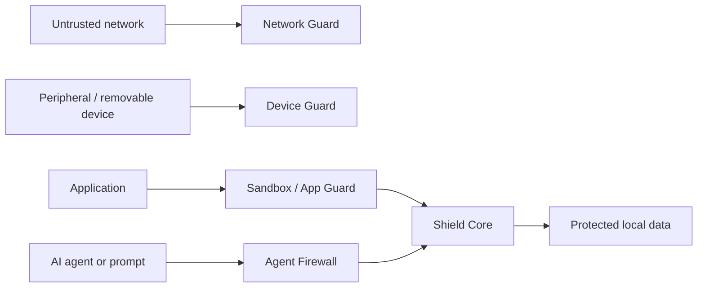

# Threat model

## Assets

User data and secrets; encryption keys; system integrity; boot state; network identity; device interfaces; application trust boundaries; agent/AI context; security events.

## Trust boundaries

## Primary threat classes

| Threat | Desired response direction |
| --- | --- |
| Malicious or compromised application | Sandbox, restrict capabilities, isolate, retain an explainable event record. |
| Network attack or unexpected egress | Default-deny policy options, connection visibility, containment. |
| Hostile device or removable media | Device mediation, explicit consent, constrained access. |
| Boot or storage tampering | Boot integrity design and encrypted storage. |
| Privilege escalation | Mandatory access-control and least-privilege design review. |
| Prompt injection / agent abuse | Agent Firewall, tool/data boundaries, provenance and user consent. |
| Data exfiltration or telemetry creep | Local-first privacy model, no mandatory telemetry, auditable exceptions. |

## Assumptions and open risks

Physical access, firmware, supply chain, kernel vulnerabilities, and user-approved actions remain material risks. The project will define mitigations and residual-risk acceptance through ADRs and implementation-phase testing.
