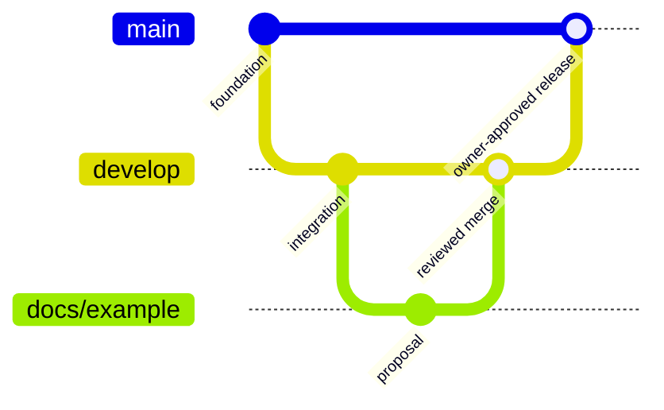

# Development workflow

## Branch strategy

- `main`: protected, stable, owner-controlled source of truth.
- `develop`: protected integration branch; created when work begins.
- Short-lived branches: `docs/`, `proposal/`, `security/`, `privacy/`, `adr/`, `chore/`.

## Review flow

1. Open an issue for consequential work.
2. Branch from the agreed base.
3. Make one coherent pull request using the template.
4. Run documentation checks and obtain required review.
5. The owner makes the final merge decision for `main`.

## Working agreements

Use the [operating model](operating-model.md) for the discovery-to-delivery loop, [quality gates](quality-gates.md) for readiness, and [project board guidance](project-board.md) when approved work begins. Design changes should use the [security and privacy review checklist](../security/security-review-checklist.md).

## GitHub configuration intent

Protect `main` with pull requests, required reviews, conversation resolution, linear history where compatible, and the documentation-check status check. Do not require CODEOWNERS review until real owners are assigned. Protect `develop` similarly when it is created. Bypass permissions should remain limited to the owner/administrators according to organization policy.
