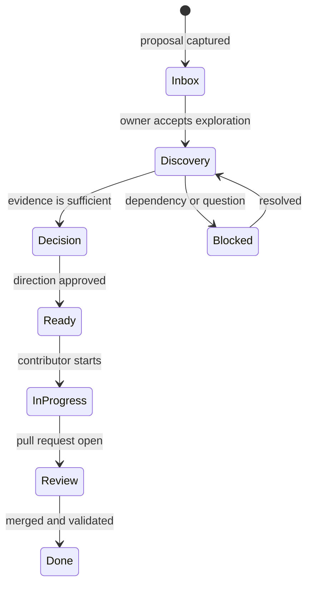

# Project board usage

The GitHub Project is a shared view of approved work—not a dumping ground for every idea. It remains intentionally empty until the owner approves the first discovery items.

## Recommended flow

## Board fields to introduce when work begins

| Field | Purpose |
| --- | --- |
| Status | Show flow from Inbox to Done. |
| Area | Architecture, security, privacy, platform, UX, documentation or operations. |
| Risk | Low, medium, high or critical—based on potential impact, not effort. |
| Decision needed | Distinguish discovery from work that needs owner direction. |

Avoid estimates, dates, assignees and iterations until the team agrees that they support rather than obscure the work.
